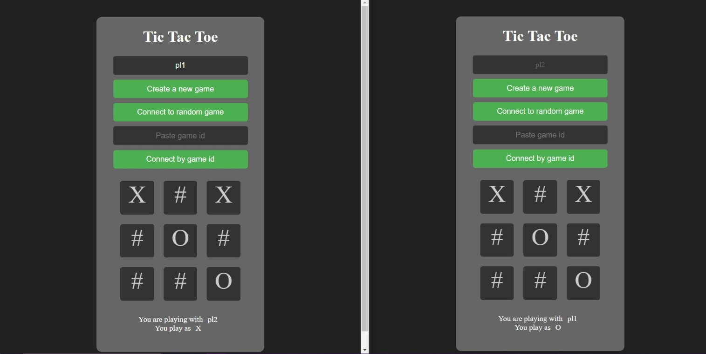

# Maja Placek - Terraform, EC2, TicTacToe report

- Course: Cloud programming
- Group: monday 9:15
- Date: 

## Environment architecture

## Elastic Beanstalk

### Provider Configuration
- **AWS Provider**: Region set to `us-east-1`.

### Networking Components
- **VPC**: `app_vpc` (CIDR: `10.0.0.0/16`) - DNS support, and DNS hostnames enabled
  - **Internet Gateway**: `app_gw`
  - **Subnets**:
    - `backend_subnet` (CIDR: `10.0.1.0/24`, AZ: `us-east-1a`)
    - `frontend_subnet` (CIDR: `10.0.2.0/24`, AZ: `us-east-1b`)
  - **Route Table**: `app_rt`
    - Routes all traffic (`0.0.0.0/0`) to the internet gateway.
    - Associated with both subnets.

### Security Groups
- **Backend SG**: `backend_sg`
  - Inbound: TCP on port `8080` (from `0.0.0.0/0`)
  - Outbound: All traffic
- **Frontend SG**: `frontend_sg`
  - Inbound: TCP on port `3000` (from `0.0.0.0/0`)
  - Outbound: All traffic

### Elastic Beanstalk Applications and Environments
- **Applications**:
  - `backend_app`
  - `frontend_app`
- **Environments**:
  - `backend-env-1`
    - Application: `backend_app`
    - Version: `backend_version`
    - Configured for VPC, subnet, public IP, service role, architecture, instance type, security group.
  - `frontend-env-1`
    - Application: `frontend_app`
    - Version: `frontend_version`
    - Configured for VPC, subnet, public IP, service role, architecture, instance type, security group.

### S3 Buckets and Objects
- **Bucket**: `appbuckettictactoe`
  - **Objects**:
    - `backend_deploy.zip`
    - `frontend_deploy.zip`

### Outputs
- **Backend URL**: `http://${aws_elastic_beanstalk_environment.backend_env.cname}:8080`
- **Frontend URL**: `http://${aws_elastic_beanstalk_environment.frontend_env.cname}:3000`

## Fargate

### Provider Configuration
- **AWS Provider**: Region set to `us-east-1`.

### Networking Components
- **VPC**: `tictactoe_vpc` (CIDR: `10.0.0.0/16`)
  - **Internet Gateway**: `tictactoe_gateway`
  - **Subnets**:
    - `tictactoe_subnet1` (CIDR: `10.0.1.0/24`, AZ: `us-east-1a`)
    - `tictactoe_subnet2` (CIDR: `10.0.2.0/24`, AZ: `us-east-1b`)
  - **Route Table**: `tictactoe_route_table`
    - Routes all traffic (`0.0.0.0/0`) to the internet gateway.
    - Associated with both subnets.

### Security Groups
- **Backend SG**: `backend_sg`
  - Inbound: TCP on ports `8080` and `22` (from `0.0.0.0/0`)
  - Outbound: All traffic
- **Frontend SG**: `frontend_sg`
  - Inbound: TCP on ports `3000` and `22` (from `0.0.0.0/0`)
  - Outbound: All traffic
- **ALB SG**: `alb_sg`
  - Inbound: TCP on ports `3000`, `8080`, and `22` (from `0.0.0.0/0`)
  - Outbound: All traffic

### Load Balancer
- **ALB**: `tictactoe-alb`
  - Subnets: `tictactoe_subnet1` and `tictactoe_subnet2`
  - Security Group: `alb_sg`
- **Target Groups**:
  - Backend: `alb-target-gr-back`
  - Frontend: `alb-target-gr-front`
- **Listeners**:
  - Backend: `alb_listener_backend` (port `8080`)
  - Frontend: `alb_listener_frontend` (port `3000`)

### ECS Cluster and Services
- **Cluster**: `tictactoe_cluster`
- **Task Definitions**:
  - Backend: `tictactoe_backend_task`
    - Container: `backend` (port `8080`)
  - Frontend: `tictactoe_frontend_task`
    - Container: `frontend` (port `3000`)
- **Services**:
  - Backend: `tictactoe_backend_service`
    - Network: `tictactoe_subnet1` and `tictactoe_subnet2`, SG: `backend_sg`
    - Load Balancer: `alb-target-gr-back`
  - Frontend: `tictactoe_frontend_service`
    - Network: `tictactoe_subnet1` and `tictactoe_subnet2`, SG: `frontend_sg`
    - Load Balancer: `alb-target-gr-front`

### Outputs
- **Backend URL**: `http://${aws_alb.main.dns_name}:8080`
- **Frontend URL**: `http://${aws_alb.main.dns_name}:3000`

## Preview

Screenshots of configured AWS services. Screenshots of your application running.

## Reflections

### What did you learn?
  - I learned how to define application architecture using AWS Fargate and Elastic Beanstalk (EBS). Specifically, I understood the nuances of setting up infrastructure as code with Terraform to create a scalable and secure environment. The process included defining VPCs, subnets, security groups, and configuring ECS services and task definitions. Additionally, I gained practical experience in setting up an Application Load Balancer (ALB) to manage traffic efficiently and ensure high availability for both backend and frontend services.
### What obstacles did you overcome?
  - passing backend address to frontend.
    - EBS:  Initially, I faced challenges in ensuring that the frontend could reliably communicate with the backend. Using Elastic Beanstalk's static CNAME helped simplify this process by providing a consistent endpoint for the frontend to connect to
    - Fargate: the challenge was more complex. I resolved this by integrating a load balancer, which provided a DNS name for the backend service. This DNS name was then passed as an environment variable to both the backend and frontend during task definition, ensuring seamless communication.
  - browser caching frontend code
    - I encountered issues with outdated frontend code being served due to browser caching. To address this, I learned to clear the browser cache to force the browser to fetch the latest version of the frontend code.
    - Additionally, I rebuilt Docker images to ensure that any cached layers were refreshed, which helped in deploying the latest frontend code without caching issues.
  ### What did you help most in overcoming obstacles?
  - peers advice: my friends often encountered similar problems to mine, so their suggestions were very valuable for solving my problems.
  - consultation with the teacher: expertise and feedback helped clarify doubts and provided direction on best practices
### Was that something that surprised you?
  - longevity of the process of application and destruction in terraform. Each deployment involved several steps and dependencies, making it a time-consuming process. The complexity of managing state, dependencies, and ensuring that all resources were correctly provisioned or destroyed highlighted the importance of planning and understanding the underlying infrastructure. This experience underscored the importance of patience and thoroughness when working with infrastructure as code tools like Terraform.
